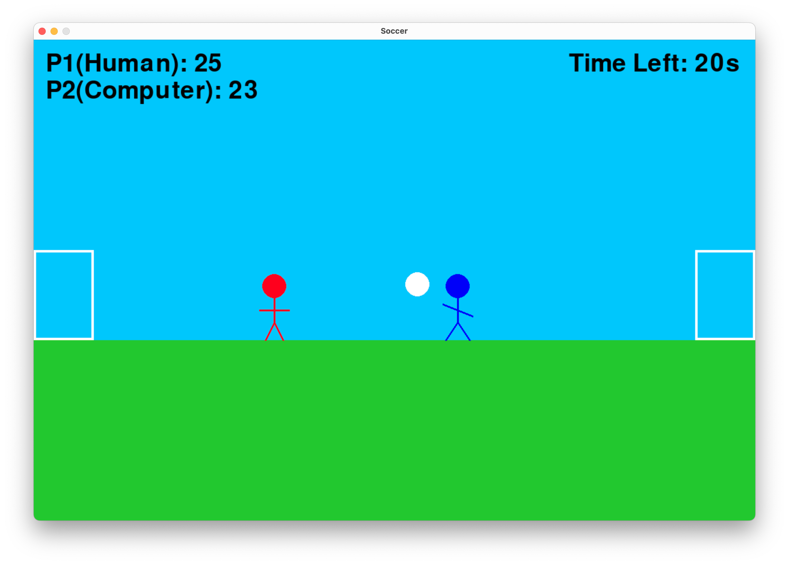

# ⚽ Soccer Game (Pygame)

A simple 2-player soccer (football) game built with Python and Pygame. Control your stickman players, dribble the ball, jump, and score goals in a fun arcade-style environment!



## 🎮 Features

- 2-player local multiplayer with keyboard controls
- Ball physics and gravity
- Player movement and jumping
- Goal detection with score tracking
- Stickman characters
- Game boundaries to keep players and ball in play

## 🛠 Requirements

- Python 3.x
- [Pygame](https://www.pygame.org/) (install with `pip install pygame`)

## 🚀 How to Run

1. Clone the repository:
   ```bash
   git clone https://github.com/hatm601/Soccer.git
   cd Soccer
